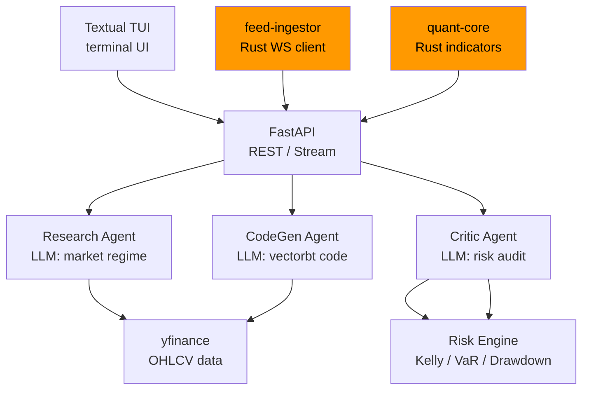

<div align="center">

# Agentic Quant Sandbox

**AI-powered autonomous trading strategy engine**

Multi-agent system with **Research**, **CodeGen**, and **Critic** agents
that analyze markets, write backtests, and validate strategies automatically.
Powered by Rust for performance-critical indicator computation and real-time
market data ingestion.

[](https://github.com/amrav69/agentic-quant-sandbox/actions/workflows/ci.yml)
[](https://python.org)
[](https://rust-lang.org)

</div>

---

## Architecture



The system has three layers:

1. **Python API layer** — FastAPI server with a 3-agent LLM pipeline
2. **Rust performance layer** — `quant-core` (fast technical indicators via FFI)
   and `feed-ingestor` (real-time WebSocket market data)
3. **Risk engine** — Kelly sizing, VaR, drawdown limits integrated into the critic

---

## Prerequisites

- **Python** 3.11+
- **Rust** 1.75+ (stable) — only needed if using the Rust crates
- **Docker** (optional, for containerised deployment)
- API keys for at least one LLM provider (see [Environment](#environment-variables))

---

## Quick Start — Manual

```bash
# 1. Clone and enter
git clone https://github.com/amrav69/agentic-quant-sandbox.git
cd agentic-quant-sandbox

# 2. Configure environment
cp .env.example .env
# Edit .env with your API keys (see below)

# 3. Install Python dependencies
pip install -r requirements.txt

# 4. (Optional) Build Rust crates
cargo build --workspace

# 5. Start the API server
uvicorn backend.main:app --reload --host 0.0.0.0 --port 8000

# 6. In a second terminal, launch the TUI
python tui.py
```

---

## Quick Start — Docker

```bash
docker compose up --build
```

This starts two services:
- **api** — FastAPI server on port 8000
- **tui** — Terminal UI (requires a terminal that supports Textual)

---

## API Reference

| Method | Path | Description | Request Body | Response |
|--------|------|-------------|-------------|----------|
| `GET` | `/` | Root status | — | `{"status": "running"}` |
| `GET` | `/health` | Health check | — | `{"status": "healthy"}` |
| `POST` | `/analyze` | Research analysis | `{"symbol": "...", "price": ...}` | Agent analysis JSON |
| `GET` | `/analyze/{symbol}` | Autonomous analysis (data + indicators + AI) | — | `{symbol, live_indicators, ai_analysis}` |
| `POST` | `/generate` | Research → CodeGen pipeline | `{"symbol": "...", ...}` | `{research_analysis, generated_code}` |
| `POST` | `/critique` | Full 3-agent pipeline (Research → CodeGen → Critic) | `{"symbol": "...", ...}` | `{research_analysis, generated_code, critique}` |
| `POST` | `/analyze/stream` | Streaming SSE pipeline | `{"symbol": "...", ...}` | `text/event-stream` with per-stage events |
| `POST` | `/cache/clear` | Flush data cache | — | `{"status": "cache cleared"}` |

---

## Environment Variables

| Variable | Required | Default | Description |
|----------|----------|---------|-------------|
| `GEMINI_API_KEY` | Yes* | — | Google Gemini API key |
| `GROQ_API_KEY` | Yes* | — | Groq API key (used by default) |
| `OPENAI_API_KEY` | No | — | OpenAI API key |
| `POLYGON_API_KEY` | No | — | Polygon.io real-time data |
| `ALPACA_API_KEY` | No | — | Alpaca trading API key |
| `ALPACA_SECRET_KEY` | No | — | Alpaca trading secret |
| `REDIS_URL` | No | `redis://localhost:6379/0` | Redis connection string |
| `LOG_LEVEL` | No | `INFO` | Logging level (`DEBUG`, `INFO`, `WARNING`) |
| `LOG_FORMAT` | No | `console` | Log format (`console` or `json`) |
| `MAX_RETRIES` | No | `3` | LLM call retry count |
| `REQUEST_TIMEOUT_SEC` | No | `30` | HTTP client timeout |

\* At least one LLM provider key is required.

---

## Running Tests

```bash
# Python tests
pytest --tb=short -q

# Rust tests
cargo test --workspace

# Both
make test
```

---

## Rust Crates

### quant-core
Pure Rust technical indicator library:
- SMA, EMA, RSI, MACD, Bollinger Bands
- C FFI interface (`calc_rsi`)
- Optional Python binding (`cargo build --features python`)
- Panic-free — all functions return `Result`

### feed-ingestor
Async WebSocket market data consumer:
- Connects to Polygon or Alpaca streaming APIs
- Outputs JSON Lines to stdout (pipe to Python subprocess)
- Graceful shutdown on Ctrl-C
- `--dry-run` flag for CI testing

```bash
# Usage
WS_URL=wss://socket.polygon.io/stocks SYMBOLS=AAPL,TSLA \
  cargo run --bin feed-ingestor -- --dry-run
```

---

## Makefile Targets

| Target | Description |
|--------|-------------|
| `make install` | Install Python deps + build Rust |
| `make dev` | Start FastAPI dev server on port 8000 |
| `make test` | Run Python + Rust test suites |
| `make build` | Build Rust release binaries |
| `make lint` | Run ruff + clippy |
| `make fmt` | Format all code (ruff + rustfmt) |
| `make docker-up` | `docker compose up --build -d` |
| `make docker-down` | `docker compose down` |

---

## License

MIT
